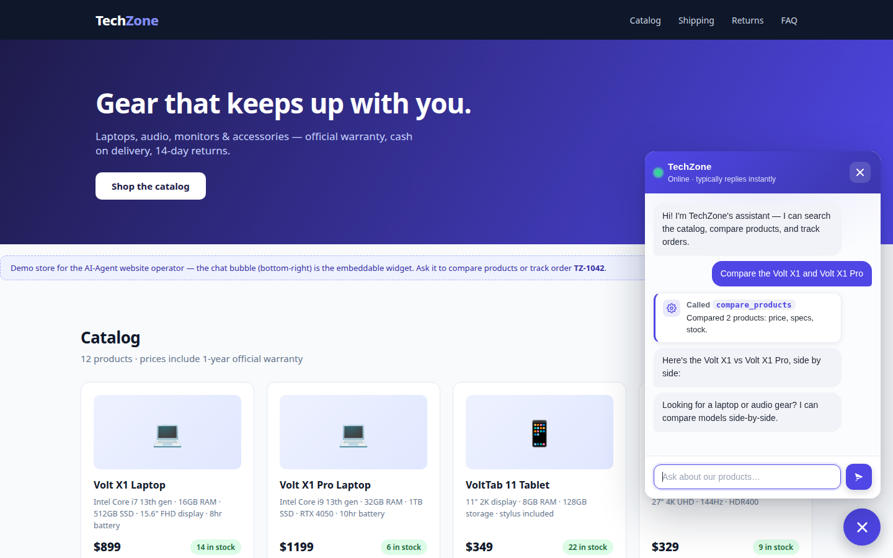
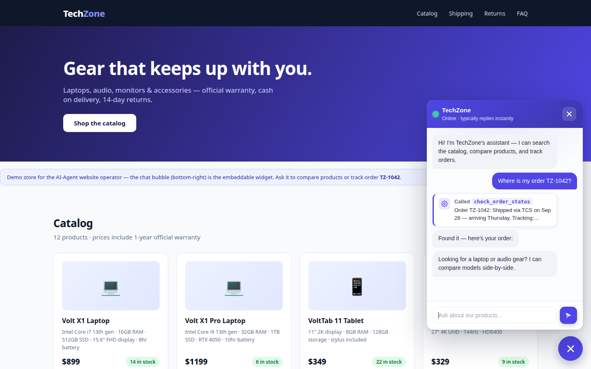
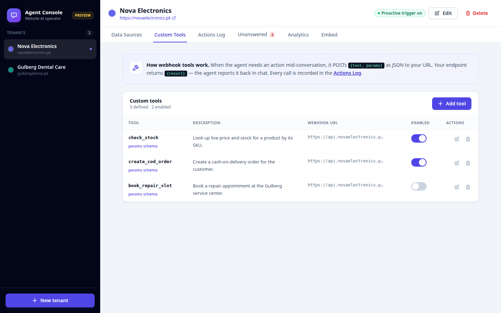

# AI-Agent — the agent that operates your website

One `<script>` tag turns any website into an AI-operated storefront. This is **not** a FAQ chatbot: the agent reads your site's data (products, prices, policies, docs) and **acts on it mid-conversation** — searching the catalog, comparing products, checking stock, and calling *your own* webhook tools (order status, support tickets, shipping quotes).

> A plain chatbot answers from a script. This agent **operates** — it uses tools.





*Screenshots: TechZone demo store (left/center) and the admin console (right). Demo runs on a clearly-marked mock API for screenshots; production uses the FastAPI backend below.*

## 2-minute integration

1. Start the backend (below), open `/admin`, create a tenant, crawl the site, define tools.
2. Paste the embed snippet on any website:

```html
<script src="https://YOUR-SERVER/widget.js"
  data-tenant="tnt_abc123"
  data-color="#4f46e5"
  data-name="Your Business"></script>
```

That's it — the chat bubble appears, styled in your brand color, answering from *your* data.

## What it does

| Capability | How |
|---|---|
| **Deep site knowledge** | Crawls `sitemap.xml` (or homepage links) into a per-tenant Chroma vector index **and** a structured extract — products with prices/specs/stock, FAQs, policies. Admin shows what was learned per page. |
| **Custom webhook tools (the core)** | In admin, define tools: name, description, JSON params, POST webhook URL — e.g. `check_order_status`, `create_support_ticket`, `get_shipping_quote`. The agent calls them mid-conversation and reports results back in chat. |
| **Built-in catalog tools** | `search_products`, `compare_products`, `check_stock`, `search_knowledge_base` work out of the box on the crawled data. |
| **Actions log** | Every tool call — params, result, duration — recorded and visible in admin. Full transparency into what the agent did. |
| **Learning loop** | Questions the agent can't answer land in the **Unanswered** inbox. The owner answers once → it's auto-ingested into that tenant's knowledge base. |
| **Analytics** | Top questions, per-tool call counts, conversations that ended unresolved. |
| **Page-aware** | The widget sends the current page URL + title with every message; the agent tailors answers ("On this pricing page…"). |
| **One proactive trigger** | Configurable nudge on high-intent pages (e.g. `/pricing`, `/checkout`) after N seconds — no exit-intent gimmicks. |

## Custom tools: webhook contract

Your endpoint receives:

```json
POST https://your-api.example.com/tools/order-status
{ "tool": "check_order_status", "params": { "order_id": "TZ-1042" } }
```

It returns:

```json
{ "result": "Order TZ-1042: shipped via TCS — arriving Thursday." }
```

The agent relays the result in chat and the call lands in the Actions log. The demo tenant ships with a working example (`check_order_status` → `/api/demo/order-status`).

## How data ingestion works

```
website URL → crawler (sitemap.xml, same-domain, ≤50 pages)
            → clean text per page
            → extract.py: products (price patterns), FAQs (Q/A shapes), policies (shipping/returns/warranty)
            → products → SQLite (structured, powers compare/stock tools)
            → text chunks → Chroma tenant_<id> collection (powers knowledge search)
PDF/TXT/MD uploads → same pipeline
Re-crawl replaces the tenant's collection.
```

## Run locally

Needs Python 3.10+ and [Ollama](https://ollama.com) running locally (free, no API key).

```bash
pip install -r requirements.txt
cp .env.example .env            # defaults work out of the box
ollama pull qwen2.5:7b          # agent brain
ollama pull nomic-embed-text    # embeddings
uvicorn app:app --reload
```

Then:
- **Admin console** → http://localhost:8000/admin (tenants, crawl, tools, actions log, unanswered, analytics, embed snippet)
- **Demo store** → http://localhost:8000/demo (TechZone electronics — widget embedded; ask it to compare the two laptops or track order `TZ-1042`)
- **Widget files** → `/widget.js`, `/widget.css`

Prefer hosted? Set `LLM_PROVIDER=groq`, `LLM_MODEL=llama-3.3-70b-versatile`, `GROQ_API_KEY=…` in `.env`.

### Seed the demo tenant

```bash
curl -X POST localhost:8000/api/tenants -H 'Content-Type: application/json' \
  -d '{"name":"TechZone","website":"https://example.com","brand_color":"#4f46e5"}'
# → {"id":"tnt_..."}
curl -X POST localhost:8000/api/tenants/tnt_.../seed-demo
```

This loads the 12-product catalog and the demo `check_order_status` webhook tool.

## API reference

| Method | Route | Purpose |
|---|---|---|
| GET | `/` | health |
| GET/POST | `/api/tenants` | list / create tenant |
| GET/PUT/DELETE | `/api/tenants/{id}` | tenant CRUD (brand color, welcome, trigger) |
| GET | `/api/tenants/{id}/widget-config` | public widget config |
| POST | `/api/tenants/{id}/ingest` | `{website_url}` → crawl + extract + index |
| POST | `/api/tenants/{id}/upload` | PDF/TXT/MD files → index |
| GET | `/api/tenants/{id}/pages` | per-page extracts (products/FAQs/policies) |
| GET/POST | `/api/tenants/{id}/tools` | custom webhook tools |
| PUT/DELETE | `/api/tenants/{id}/tools/{tool_id}` | edit / delete tool |
| POST | `/api/chat` | `{tenant_id, session_id, message, page_url, page_title}` → `{reply, sources, tools_used}` |
| GET | `/api/tenants/{id}/actions` | actions log |
| GET | `/api/tenants/{id}/unanswered` | learning-loop inbox |
| POST | `/api/tenants/{id}/unanswered/{qid}/answer` | answer → auto-ingested |
| GET | `/api/tenants/{id}/analytics` | top questions, tool counts, unresolved |
| POST | `/api/tenants/{id}/seed-demo` | TechZone demo data |

## Project layout

```
app.py                 FastAPI: tenants, ingest, tools, chat, actions, analytics, static
storage.py             SQLite: tenants, tools, tool_calls, products, pages, conversations, unanswered
agent/
  agent.py             tenant-aware ReAct loop (LangChain chat models, manual tool loop)
  tools.py             built-ins (catalog/KB) + custom webhook dispatcher + actions logging
  prompts.py           operator system prompt (page-aware, tool-use rules)
ingest/
  crawler.py           sitemap → same-domain crawl (≤50 pages)
  extract.py           heuristic extract: products / FAQs / policies per page
  loaders.py           PDF / TXT / Markdown
  pipeline.py          chunk → embed → per-tenant Chroma collection
widget/
  widget.js / widget.css   zero-dependency Shadow-DOM chat widget (data-* config)
admin/index.html       console: tenants, data sources, custom tools, actions log,
                       unanswered inbox, analytics, embed snippet  (?preview=1 for no-backend preview)
demo/index.html        TechZone electronics demo store (12 products, policies, FAQ)
seed_data.py           demo catalog + policies + FAQs
```

## What needs real services to go live

- **LLM**: Ollama running locally (`qwen2.5:7b` + `nomic-embed-text`), or a `GROQ_API_KEY` with `LLM_PROVIDER=groq`.
- **Custom tools**: point webhook URLs at the owner's real systems (order DB, helpdesk, CRM) — the demo `check_order_status` hits a canned local endpoint.
- **Production**: put FastAPI behind HTTPS, set a real `CHROMA_DIR`, back up `data/app.db`. The widget's `data-api` should point at your server origin.

## Notes

- This repo was rebuilt from the original single-tenant chatbot into a multi-tenant website operator. The old weather demo tool was dropped; the RAG idea became per-tenant collections.
- The demo page's mock chat (`data-mock="true"`, marked `DEMO MOCK` in code) exists only so the storefront screenshots without a backend. Production widget traffic always hits `POST /api/chat`.
